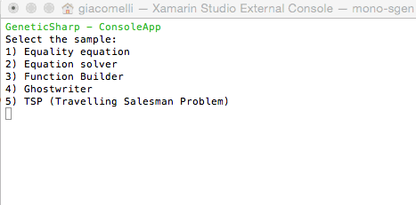
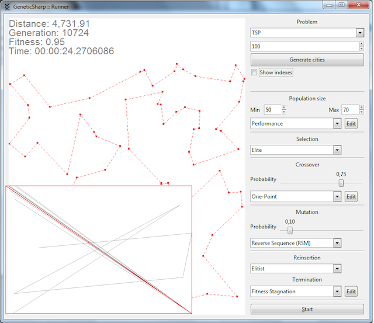
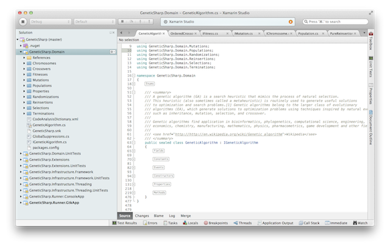
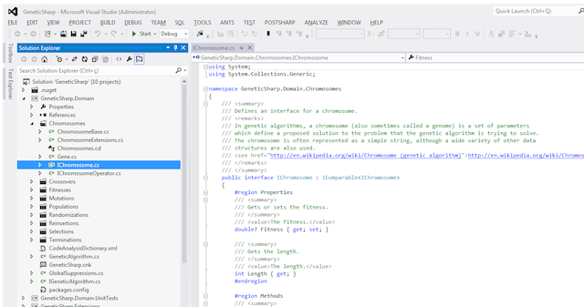

GeneticSharp
===========
[](https://ci.appveyor.com/project/giacomelli/geneticsharp)
[](https://coveralls.io/github/giacomelli/GeneticSharp?branch=master)
[](https://raw.githubusercontent.com/giacomelli/GeneticSharp/master/LICENSE)


GeneticSharp is a fast, extensible, multi-platform and multithreading C# Genetic Algorithm library that simplifies the development of applications using Genetic Algorithms (GAs).

Can be used in any kind of .NET apps, like ASP .NET MVC, Web Forms, Windows Forms, GTK# and Unity3D applications.

--------

Features
===
 - Chromosomes
   - Add your own chromosome representation implementing [IChromosome](src/GeneticSharp.Domain/Chromosomes/IChromosome.cs) interface or extending [ChromosomeBase](src/GeneticSharp.Domain/Chromosomes/ChromosomeBase.cs)   
 - [Fitness](src/GeneticSharp.Domain/Fitnesses)
   - Add your own fitness evaluation, implementing [IFitness](src/GeneticSharp.Domain/Fitnesses/IFitness.cs) interface.
 - [Populations](src/GeneticSharp.Domain/Populations)
   - [Generation](src/GeneticSharp.Domain/Populations/Generation.cs)
   - [Generation strategy](src/GeneticSharp.Domain/Populations/IGenerationStrategy.cs)
     - [Performance strategy](src/GeneticSharp.Domain/Populations/PerformanceGenerationStrategy.cs)
     - [Tracking strategy](src/GeneticSharp.Domain/Populations/TrackingGenerationStrategy.cs)  
 - [Selections](src/GeneticSharp.Domain/Selections)
   - [Elite](src/GeneticSharp.Domain/Selections/EliteSelection.cs) (also know as Truncate or Truncation)
   - [Roulette Wheel](src/GeneticSharp.Domain/Selections/RouletteWheelSelection.cs)
   - [Stochastic Universal Sampling](src/GeneticSharp.Domain/Selections/StochasticUniversalSamplingSelection.cs)
   - [Tournament](src/GeneticSharp.Domain/Selections/TournamentSelection.cs)  
   - Others selections can be added implementing [ISelection](src/GeneticSharp.Domain/Selections/ISelection.cs) interface or extending [SelectionBase](src/GeneticSharp.Domain/Selections/SelectionBase.cs). 
 - [Crossovers](src/GeneticSharp.Domain/Crossovers)
   - [Cut and Splice](src/GeneticSharp.Domain/Crossovers/CutAndSpliceCrossover.cs) 
   - [Cycle (CX)](src/GeneticSharp.Domain/Crossovers/CycleCrossover.cs)   
   - [One-Point (C1)](src/GeneticSharp.Domain/Crossovers/OnePointCrossover.cs)
   - [Ordered OX1](src/GeneticSharp.Domain/Crossovers/OrderedCrossover.cs)
   - [Partially Mapped (PMX)](src/GeneticSharp.Domain/Crossovers/PartiallyMappedCrossover.cs)
   - [Three parent](src/GeneticSharp.Domain/Crossovers/ThreeParentCrossover.cs)
   - [Two-Point (C2)](src/GeneticSharp.Domain/Crossovers/TwoPointCrossover.cs)
   - [Uniform](src/GeneticSharp.Domain/Crossovers/UniformCrossover.cs)
   - Others crossovers can be added implementing [ICrossover](src/GeneticSharp.Domain/Crossovers/ICrossover.cs) interface or extending [CrossoverBase](src/GeneticSharp.Domain/Crossovers/CrossoverBase.cs).   
 - [Mutations](src/GeneticSharp.Domain/Mutations)
   - [Reverse Sequence (RSM)](src/GeneticSharp.Domain/Mutations/ReverseSequenceMutation.cs)
   - [Twors](src/GeneticSharp.Domain/Mutations/TworsMutation.cs)
   - [Uniform](src/GeneticSharp.Domain/Mutations/UniformMutation.cs)
   - Others mutations can be added implementing [IMutation](src/GeneticSharp.Domain/Mutations/IMutation.cs) interface or extending [MutationBase](src/GeneticSharp.Domain/Mutations/MutationBase.cs).
 - [Reinsertions](src/GeneticSharp.Domain/Reinsertions)
   - [Elitist](src/GeneticSharp.Domain/Reinsertions/ElitistReinsertion.cs)
   - [Fitness Based](src/GeneticSharp.Domain/Reinsertions/FitnessBasedReinsertion.cs)
   - [Pure](src/GeneticSharp.Domain/Reinsertions/PureReinsertion.cs)
   - [Uniform](src/GeneticSharp.Domain/Reinsertions/UniformReinsertion.cs)
 - [Terminations](src/GeneticSharp.Domain/Terminations)
   - [Generation number](src/GeneticSharp.Domain/Terminations/GenerationNu)
   - [Time evolving](src/GeneticSharp.Domain/Terminations/TimeEvolvingTermination.cs)
   - [Fitness stagnation](src/GeneticSharp.Domain/Terminations/FitnessStagnationTermination.cs)
   - [Fitness threshold](src/GeneticSharp.Domain/Terminations/FitnessThresholdTermination.cs)
   - [And](src/GeneticSharp.Domain/Terminations/AndTermination.cs) e [Or](src/GeneticSharp.Domain/Terminations/OrTermination.cs) (allows combine others terminations)
 - [Randomizations](src/GeneticSharp.Domain/Randomizations)
   - [Basic randomization](src/GeneticSharp.Domain/Randomizations/BasicRandomization.cs) (using System.Random)
   - [Fast random](src/GeneticSharp.Domain/Randomizations/FastRandomRandomization.cs)   
   - If you need a special kind of randomization for your GA, just implement the [IRandomization](src/GeneticSharp.Domain/Randomizations/IRandomization.cs) interface.
 - [Runner app (console)](src/GeneticSharp.Runner.ConsoleApp) with samples: 
 	  
 	- Equality equation
 	- Equation solver
 	- Function builder
 	- Ghostwriter
 	- TSP (Travelling toman Problem)
 	
 - [Runner app (GTK#)](src/GeneticSharp.Runner.GtkApp) showing the library solving TSP (Travelling Salesman Problem).
      
 - Mono support.
       
       
 - Fully tested on Windows and MacOSX.
 - 100% code [documentation](src/Help/Documentation.chm).
 - FxCop validated.
 - Good (and well used) design patterns.  

--------

Setup
===
PM> Install-Package GeneticSharp

Usage
===

Creating your own fitness evaluation 
---
```csharp

public class MyProblemFitness : IFitness
{  
	public double Evaluate (IChromosome chromosome)
	{
		// Evaluate the fitness of chromosome.
	}
}

```

Creating your own chromosome 
---
```csharp

public class MyProblemChromosome : ChromosomeBase
{
    // Change the argument value passed to base construtor to change the length 
 	// of your chromosome.
 	public MyProblemChromosome() : base(10) 
    {
    }

	public override Gene GenerateGene (int geneIndex)
	{
		// Generate a gene base on my problem chromosome representation.
	}

	public override IChromosome CreateNew ()
	{
		return new MyProblemChromosome();
	}
}

```

Running your GA 
---
```csharp

var selection = new EliteSelection();
var crossover = new OrderedCrossover();
var mutation = new ReverseSequenceMutation();
var fitness = new MyProblemFitness();
var chromosome = new MyProblemChromosome();
var population = new Population (50, 70, chromosome);

var ga = new GeneticAlgorithm(population, fitness, selection, crossover, mutation);
ga.Termination = new GenerationNumberTermination(100);

Console.WriteLine("GA running...");
ga.Start();

Console.WriteLine("Best solution found has {0} fitness.", ga.BestChromosome.Fitness);

```

--------

Roadmap
--------
 - Unity3d game sample (WIP)
 - Improve Runner.GtkApp
   - Add new problems/classic samples
      - Checkers 
	  - Time series   
	  - Knapsack problem
 - Create the wiki
 - Add new selections   
   - Reward-based
 - Add new crossovers   
   - Order-based (OX2)
   - Position-based (POS)
   - Voting recombination
   - Alternating-position (AP)
   - Sequential Constructive (SCX)    
   - Shuffle crossover
   - Precedence Preservative Crossover (PPX)
 - Add new mutations
   - Non-Uniform
   - Flip Bit
   - Boundary
   - Gaussian 
 - Add new terminations
   - Fitness convergence 
   - Population convergence
   - Chromosome convergence   
 - MonoTouch Runner app (sample)
 - Parallel populations (islands) 
 
--------

FAQ
======

Having troubles? 
 - Ask on Twitter [@ogiacomelli](http://twitter.com/ogiacomelli).
 - Ask on [Stack Overflow](http://stackoverflow.com/questions/tagged/geneticsharp) using the tag [GeneticSharp](http://stackoverflow.com/questions/tagged/geneticsharp).
 
 --------

How to improve it?
======

Create a fork of [GeneticSharp](https://github.com/giacomelli/GeneticSharp/fork). 

Did you change it? [Submit a pull request](https://github.com/giacomelli/GeneticSharp/pull/new/master).

Donations
======
bitcoin:3GDWZCzu389UT2vwGHTML1gYxpS4pzKhVZ

  

License
======
Licensed under the The MIT License (MIT).
In others words, you can use this library for developement any kind of software: open source, commercial, proprietary and alien.


Change Log
======
 - 1.0.56 NuGet package published.
 - 0.5.0 First version.
