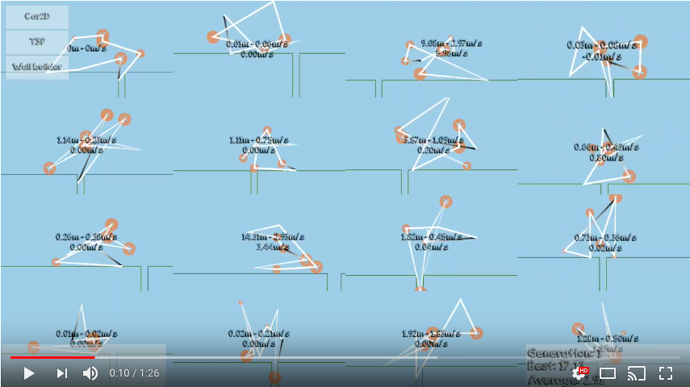

[](https://ci.appveyor.com/project/giacomelli/geneticsharp)
[](https://sonarcloud.io/dashboard?id=GeneticSharp)
[](https://sonarcloud.io/dashboard?id=GeneticSharp)
[](https://raw.githubusercontent.com/giacomelli/GeneticSharp/master/LICENSE)
[](https://www.nuget.org/packages/GeneticSharp/)
[](http://stackoverflow.com/questions/tagged/GeneticSharp)


GeneticSharp is a fast, extensible, multi-platform, and multithreading C# Genetic Algorithm library that simplifies the development of applications using Genetic Algorithms (GAs).

It can be used in any kind of .NET 6, .NET Standard, and .NET Framework apps, like ASP .NET MVC, ASP .NET Core, Blazor, Web Forms, UWP, Windows Forms, GTK#, Xamarin, MAUI and Unity3D games.


--------

## Projects, papers, journals, books, tutorials, courses, and apps using GeneticSharp
* [1st International Congress on Artificial Intelligence and Data Science (paper)](https://motto.tc/gorseller/files/kitaplar/icada2021.pdf)
* [A bi-level optimization approach for assembly line design using a nested genetic algorithm (paper)](https://www.tandfonline.com/doi/abs/10.1080/00207543.2020.1845411)
* [A CPS-Based Simulation Platform for Long Production Factories (paper)](https://www.mdpi.com/2075-4701/9/10/1025/pdf)
* [About the possibilities of implementing genetic algorithms in the C# programming language (paper)](https://elibrary.ru/item.asp?id=36794042)  
* [AeroVision: aircraft trajectories optimization and visualization (paper)](https://github.com/giacomelli/GeneticSharp/blob/master/docs/mentioning-GeneticSharp/AeroVision-Aircraft-trajectories-optimization-and-visualization.pdf)
* [Analysis and comparison between Black-Scholes and Merton and Corrado-Su for options pricing (paper)](https://github.com/giacomelli/GeneticSharp/blob/master/docs/mentioning-GeneticSharp/Analysis-and-comparison-between-Black-Scholes-and-Merton-and-Corrado-Su-for-options-pricing.pdf) 
* [An Application-Oriented Cyber-Physical Production Optimisation System Architecture for the Steel Industry (paper)](https://www.sciencedirect.com/science/article/pii/S2405896322001719)
* [An approach for the global search for top-quality six-bar dwell linkages (paper)](https://www.sciencedirect.com/science/article/pii/S0094114X22002282)
* [Application of genetic algorithms to optimize RFID antenna readings (paper)](https://github.com/gsalibi/artificial-intelligence-course/blob/master/Project%202/Relat%C3%B3rio.pdf) 
* [Approaches to Multi-Constraint Job Order Balancing (paper)](https://www.diva-portal.org/smash/get/diva2:1875545/FULLTEXT01.pdf)
* [Artificial Intelligence course in French engineering schools (course)](https://github.com/giacomelli/GeneticSharp/pull/43#issuecomment-433662175)
* [Artificial Intelligence for the Unstable Unicorns Game (paper)](https://dspace.cuni.cz/bitstream/handle/20.500.11956/183069/130360435.pdf)
* [A Software Development Framework for Complete Battery Characterization: Testing, Modelling & Parameterization (paper)](https://macsphere.mcmaster.ca/handle/11375/25423)
* [Autoloader: Cargo Handling Software for Navy and Marine Aircraft (paper)](https://www.stottlerhenke.com/wp-content/uploads/2022/03/LODR-IEEE-Aero-2022-Paper_submitted_reduced.pdf)
* [Automated linear design integrated microwave amplifier with distributed gain (paper)](https://scholar.archive.org/work/qp6k4sgorbanjer34zqfbjl7nq/access/wayback/https://vre.instel.ru/jour/article/download/1371/1102) 
* [Automated selection of structural parameters for insulated glass units (paper)](http://dspace.lu.lv/dspace/handle/7/55809) 
* [Automatic refactoring for parallelization (paper)](https://eprints.ost.ch/id/eprint/760)
* [BlazorAI: Blazor Meets Artificial Intelligence (app)](https://www.blazor.ai/) [(Github)](https://github.com/lhalsey/BlazorAI)
* [Context-Sensitive Code Completion: improving predictions with genetic algorithms (paper)](https://github.com/giacomelli/GeneticSharp/blob/master/docs/mentioning-GeneticSharp/Context-Sensitive-Code-Completion-improving-predictions-with-genetic-algorithms.pdf) [(Github)](https://github.com/godtopus/GeneCSCC)
* [Deriving Functions for Pareto Optimal Fronts Using Genetic Programming (paper/book)](https://books.google.com.br/books?id=w_lcDwAAQBAJ&lpg=PA473&ots=Rv7O6FhCSM&dq=%22GeneticSharp%22&hl=pt-BR&pg=PA464#v=onepage&q=%22GeneticSharp%22&f=false)
* [Designing and creating a self managing distributed file system (paper)](https://github.com/giacomelli/GeneticSharp/blob/master/docs/mentioning-GeneticSharp/Designing-and-creating-a-self-managing-distributed-file-system.pdf)
* [Design and optimization of a GFRP and steel hybrid prestressed SFRC beam based on numerical and analytical approaches (paper)](https://repositorium.sdum.uminho.pt/handle/1822/88537)
* [Design of a warehouse order picking policy using genetic algorithm (paper)](https://github.com/giacomelli/GeneticSharp/blob/master/docs/mentioning-GeneticSharp/Design-of-a-warehouse-order-picking-policy-using-genetic-algorithm.pdf)
* [Development of a Coupled Hydrological and Buildup/Washoff Watershed Model (paper)](https://ascelibrary.org/doi/abs/10.1061/9780784482957.014) 
* [Developing trading strategies with genetic algorithms (forum)](https://www.quantconnect.com/forum/discussion/2396/developing-trading-strategies-with-genetic-algorithms) [(paper)](https://github.com/giacomelli/GeneticSharp/blob/master/docs/mentioning-GeneticSharp/Developing-Trading-Strategies-with-Genetic-Algorithms.pdf)
* [Discrete and mixed-variable experimental design with surrogate-based approach (paper)](https://pubs.rsc.org/en/content/articlehtml/2024/dd/d4dd00113c)
* [Evolving Woodland Camouflage (paper)](https://ieeexplore.ieee.org/abstract/document/9850354)
* [Fabrication of Adiabatic Quantum-Flux-Parametron Integrated Circuits Using an Automatic Placement Tool Based on Genetic Algorithms (paper)](https://ieeexplore.ieee.org/document/8643945)
* [Framework for graphical user interface testing (paper)](https://theses.cz/id/fn6jrd/24813.pdf) 
* [Frixel: 2D framing / pixel structural optimization (project)](https://github.com/EmilPoulsen/Frixel)
* [Function optimization with GeneticSharp (tutorial)](http://diegogiacomelli.com.br/function-optimization-with-geneticsharp/)
* [General parametric design of a steel-glubam hybrid space truss (paper/book)](https://books.google.com.br/books?id=NO-yDwAAQBAJ&pg=PA223&lpg=PA223&dq=General+parametric+design+of+a+steel-glubam+hybrid+space+truss&source=bl&ots=ZKXlHYvcyv&sig=ACfU3U16QhsofRyEdRTAIN6_JDyEATPkqQ&hl=pt-BR&sa=X&ved=2ahUKEwjrs_XZgdTmAhW1CrkGHTA2BrMQ6AEwCnoECAoQAQ#v=onepage&q=geneticsharp&f=false)
* [GeneticDFA: reverse engineer blackbox systems modeled in DFA form (project)](https://github.com/KarmaKamikaze/GeneticDFA)
* [GeneticSharp Car2D (sample)](http://diegogiacomelli.com.br/GeneticSharp-Car2D/)
* [GeneticSharp Unity3d Samples (Android app)](https://play.google.com/store/apps/details?id=br.com.diegogiacomelli.geneticsharprunnersunityapp)
* [Genetic Scheduler: a genetic algorithm for scheduling tasks with temporal restriction in distributed systems (paper)](https://github.com/giacomelli/GeneticSharp/blob/master/docs/mentioning-GeneticSharp/Genetic-Scheduler.pdf) 
* [Genetic-WFC: Extending Wave Function Collapse With Genetic Search (paper)](https://ieeexplore.ieee.org/document/9836972)
* [Human-Robot Collaborative Workflow for Remote Decommissioning and Demolition (paper)](https://conferences.lib.unb.ca/index.php/tcrc/article/view/616)
* [Incremental Evolution of Stylized Images (paper)](https://link.springer.com/chapter/10.1007/978-3-030-72914-1_19)
* [Lean Optimization: genetic optimization using LEAN (GitHub)](https://github.com/Jay-Jay-D/LeanOptimization) 
* [Mapping of White Dwarfs in AM Her Systems (paper)](https://link.springer.com/article/10.1134/S1063773720120026)
* [Modelling and Simulation Analysis of Goal-Oriented Business Process (paper)](https://github.com/giacomelli/GeneticSharp/blob/master/docs/mentioning-GeneticSharp/Modelling-and-Simulation-Analysis-of-Goal-Oriented-Business-Process.pdf) 
* [Movement Simulation of a Handheld Device (paper)](https://theses.cz/id/ff90q1/thesis.pdf) 
* [Multiple Autonomous Drone Mission Planning (paper)](https://run.unl.pt/bitstream/10362/178449/1/Jorge_2024.pdf) 
* [Object distribution system in a limited space using genetic algorithms (paper)](https://ela.kpi.ua/bitstream/123456789/29512/1/Kovalchuk_bakalavr.docx)  
* [OpenFMSL: simulate stationary chemical processes using mass and energy balances (project)](https://github.com/Nukleon84/OpenFMSL)
* [Optimization by genetic algorithm of lattices structures for the media generation in additive manufacturing (paper)](https://github.com/giacomelli/GeneticSharp/blob/master/docs/mentioning-GeneticSharp/Optimisation-par-algorithme-genetique-de-structures-lattices.pdf) 
* [Optimization of a Subsea Design using an Evolutionary Algorithm (paper)](https://www.onepetro.org/conference-paper/BHR-2019-023)
* [Optimization of customer assignment problem (paper)](https://motto.tc/gorseller/files/kitaplar/icada2021.pdf)
* [Optimization of patient flow in emergency departments using Genetic Algorithms (paper)](https://github.com/giacomelli/GeneticSharp/blob/master/docs/mentioning-GeneticSharp/Optimization-of-Patient-Flow-in-Emergency-Departments-using-Genetic-Algorithms.pdf)
* [Optimization of part orientation and design of support structures in laser powder bed fusion (paper)](https://link.springer.com/article/10.1007/s12008-022-00856-7)
* [Optimization of self-supporting steel towers for transmission lines with genetic algorithms (paper)](https://repositorio.ufmg.br/handle/1843/47381) 
* [Optimized Work Schedule Generation in Construction Projects (paper)](https://www1.pub.informatik.uni-wuerzburg.de/pub/theses/2024-raies-masterarbeit.pdf)
* [Overload journal 142: Evolutionary computing frameworks for optimisation (journal)](https://accu.org/var/uploads/journals/Overload142.pdf)
* [Path Finding with Genetic Algorithms (project)](https://yoloprogramming.com/post/2017/01/11/path-finding-with-genetic-algorithms)
* [Research of lift and transport machine systems plot of processing and food enterprises (paper)](http://socrates.vsau.org/b04213/html/cards/getfile.php/29620.pdf)  
* [Selecting Deconstruction Processes using Virtual Reality Comparisons (paper)](https://ieeexplore.ieee.org/abstract/document/10849358)
* [SiliFish: software to model spinal control of motor movement in larval zebrafish (project)](https://github.com/Bui-lab/SiliFish)
* [Simulation-based layout optimization for multi-station assembly lines (paper)](https://link.springer.com/content/pdf/10.1007/s10845-021-01853-5.pdf)
* [Software system for intellectual formation of starting populations (paper)](https://ela.kpi.ua/server/api/core/bitstreams/a607c6ea-5dad-411e-96e9-c9f090a123b5/content)  
* [Study of methods of application of genetic algorithms for determining the viability of moving objects and their systems (paper)](https://dspace.cuni.cz/bitstream/handle/20.500.11956/183069/130360435.pdf)
* [SurvivorAI: some experiments of survival scenarios (project)](https://github.com/giacomelli/SurvivorAI)
* [System for the decision-making support of the synthesis of physical topology of collection and data transfer network in energy management system (paper)](http://hi-tech.asu.edu.ru/files/1(45)/193-210.pdf) 
* [The Method of Studying of Electromagnetic Characteristics and Synthesis of Metamaterial (paper)](https://cyberleninka.ru/article/n/metodika-issledovaniya-elektromagnitnyh-harakteristik-i-sinteza-metamateriala) 
* [ThermalDesign (project)](https://github.com/simonjduff/ThermalDesign)
* [TrussOptimization (project)](https://trussoptimizationweb.herokuapp.com)
* [TSP with GeneticSharp and Unity3D (tutorial)](http://diegogiacomelli.com.br/tsp-with-GeneticSharp-and-Unity3d/)
* [Using Genetic Algorithms for the Generation of Increasingly Challenging Terrain for Players to Navigate (paper)](https://ieeexplore.ieee.org/abstract/document/10570021)
* [VetMedData.NET: a .NET Core class library for obtaining structured data on UK-licensed Veterinary Medicines (project)](https://github.com/Jongmassey/VetMedData.NET)
* [Visualization of the process of solving selected optimization problems using genetic algorithms (paper)](https://dspace.cvut.cz/handle/10467/109406) 
* Are you using GeneticSharp in your project? Please, [let me know!](https://twitter.com/ogiacomelli)

## Features

### [Chromosomes](src/GeneticSharp.Domain/Chromosomes)
  - [FloatingPointChromosome](src/GeneticSharp.Domain/Chromosomes/FloatingPointChromosome.cs)
  - [IntegerChromosome](src/GeneticSharp.Domain/Chromosomes/IntegerChromosome.cs)
  - Add your own chromosome representation implementing [IChromosome](src/GeneticSharp.Domain/Chromosomes/IChromosome.cs) / [IBinaryChromosome](src/GeneticSharp.Domain/Chromosomes/IBinaryChromosome.cs) interfaces or extending [ChromosomeBase](src/GeneticSharp.Domain/Chromosomes/ChromosomeBase.cs) / [BinaryChromosomeBase](src/GeneticSharp.Domain/Chromosomes/BinaryChromosomeBase.cs).
   
### [Fitness](src/GeneticSharp.Domain/Fitnesses)
Add your own fitness evaluation, implementing [IFitness](src/GeneticSharp.Domain/Fitnesses/IFitness.cs) interface.

### [Populations](src/GeneticSharp.Domain/Populations)
   - [Population](src/GeneticSharp.Domain/Populations/Population.cs)
   - [TplPopulation](src/GeneticSharp.Domain/Populations/TplPopulation.cs)
   - Others populations can be added implementing [IPopulation](src/GeneticSharp.Domain/Populations/IPopulation.cs) interface or extending [Population](src/GeneticSharp.Domain/Populations/Population.cs).

### [Generations](src/GeneticSharp.Domain/Populations/Generation.cs)
   - [Generation](src/GeneticSharp.Domain/Populations/Generation.cs)
   - [Generation strategy](src/GeneticSharp.Domain/Populations/IGenerationStrategy.cs)
     - [Performance strategy](src/GeneticSharp.Domain/Populations/PerformanceGenerationStrategy.cs)
     - [Tracking strategy](src/GeneticSharp.Domain/Populations/TrackingGenerationStrategy.cs)  
     - Others generation strategies can be added implementing [IGenerationStrategy.cs](src/GeneticSharp.Domain/Populations/IGenerationStrategy.cs) interface.
     
### [Operators strategy](src/GeneticSharp.Domain/src/GeneticSharp.Domain/OperatorsStrategy/IOperatorsStrategy.cs)
   - [DefaultOperatorsStrategy](src/GeneticSharp.Domain/OperatorsStrategy/DefaultOperatorsStrategy.cs)
   - [TplOperatorsStrategy](src/GeneticSharp.Domain/OperatorsStrategy/TplOperatorsStrategy.cs)
   - Others operators strategies can be added implementing [IOperatorsStrategy](src/GeneticSharp.Domain/OperatorsStrategy/IOperatorsStrategy.cs) interface.

### [Selections](src/GeneticSharp.Domain/Selections)
   - [Elite](src/GeneticSharp.Domain/Selections/EliteSelection.cs)
   - [Roulette Wheel](src/GeneticSharp.Domain/Selections/RouletteWheelSelection.cs)
   - [Stochastic Universal Sampling](src/GeneticSharp.Domain/Selections/StochasticUniversalSamplingSelection.cs)
   - [Tournament](src/GeneticSharp.Domain/Selections/TournamentSelection.cs)  
   - [Truncation](src/GeneticSharp.Domain/Selections/TruncationSelection.cs)
   - Others selections can be added implementing [ISelection](src/GeneticSharp.Domain/Selections/ISelection.cs) interface or extending [SelectionBase](src/GeneticSharp.Domain/Selections/SelectionBase.cs). 

### [Crossovers](src/GeneticSharp.Domain/Crossovers)
   - [Alternating-position (AP)](src/GeneticSharp.Domain/Crossovers/AlternatingPositionCrossover.cs)  
   - [Cut and Splice](src/GeneticSharp.Domain/Crossovers/CutAndSpliceCrossover.cs) 
   - [Cycle (CX)](src/GeneticSharp.Domain/Crossovers/CycleCrossover.cs)   
   - [One-Point (C1)](src/GeneticSharp.Domain/Crossovers/OnePointCrossover.cs)
   - [Order-based (OX2)](src/GeneticSharp.Domain/Crossovers/OrderBasedCrossover.cs)
   - [Ordered (OX1)](src/GeneticSharp.Domain/Crossovers/OrderedCrossover.cs)
   - [Partially Mapped (PMX)](src/GeneticSharp.Domain/Crossovers/PartiallyMappedCrossover.cs)
   - [Position-based (POS)](src/GeneticSharp.Domain/Crossovers/PositionBasedCrossover.cs)
   - [Three parent](src/GeneticSharp.Domain/Crossovers/ThreeParentCrossover.cs)
   - [Two-Point (C2)](src/GeneticSharp.Domain/Crossovers/TwoPointCrossover.cs)
   - [Uniform](src/GeneticSharp.Domain/Crossovers/UniformCrossover.cs)
   - [Voting Recombination (VR)](src/GeneticSharp.Domain/Crossovers/VotingRecombinationCrossover.cs)  
   - Others crossovers can be added implementing [ICrossover](src/GeneticSharp.Domain/Crossovers/ICrossover.cs) interface or extending [CrossoverBase](src/GeneticSharp.Domain/Crossovers/CrossoverBase.cs).   

### [Mutations](src/GeneticSharp.Domain/Mutations)
   - [Displacement](src/GeneticSharp.Domain/Mutations/DisplacementMutation.cs)
   - [Flip Bit](src/GeneticSharp.Domain/Mutations/FlipBitMutation.cs)
   - [Insertion](src/GeneticSharp.Domain/Mutations/InsertionMutation.cs)
   - [Partial Shuffle (PSM)](src/GeneticSharp.Domain/Mutations/PartialShuffleMutation.cs)
   - [Reverse Sequence (RSM)](src/GeneticSharp.Domain/Mutations/ReverseSequenceMutation.cs)
   - [Twors](src/GeneticSharp.Domain/Mutations/TworsMutation.cs)
   - [Uniform](src/GeneticSharp.Domain/Mutations/UniformMutation.cs)
   - Others mutations can be added implementing [IMutation](src/GeneticSharp.Domain/Mutations/IMutation.cs) interface or extending [MutationBase](src/GeneticSharp.Domain/Mutations/MutationBase.cs) / [SequenceMutationBase](src/GeneticSharp.Domain/Mutations/SequenceMutationBase.cs).

### [Reinsertions](src/GeneticSharp.Domain/Reinsertions)
   - [Elitist](src/GeneticSharp.Domain/Reinsertions/ElitistReinsertion.cs)
   - [Fitness Based](src/GeneticSharp.Domain/Reinsertions/FitnessBasedReinsertion.cs)
   - [Pure](src/GeneticSharp.Domain/Reinsertions/PureReinsertion.cs)
   - [Uniform](src/GeneticSharp.Domain/Reinsertions/UniformReinsertion.cs)
   - Others reinsertions can be added implementing [IReinsertion](src/GeneticSharp.Domain/Reinsertions/IReinsertion.cs) interface or extending [ReinsertionBase](src/GeneticSharp.Domain/Reinsertions/ReinsertionBase.cs).

### [Terminations](src/GeneticSharp.Domain/Terminations)
   - [Generation number](src/GeneticSharp.Domain/Terminations/GenerationNu)
   - [Time evolving](src/GeneticSharp.Domain/Terminations/TimeEvolvingTermination.cs)
   - [Fitness stagnation](src/GeneticSharp.Domain/Terminations/FitnessStagnationTermination.cs)
   - [Fitness threshold](src/GeneticSharp.Domain/Terminations/FitnessThresholdTermination.cs)
   - [And](src/GeneticSharp.Domain/Terminations/AndTermination.cs) e [Or](src/GeneticSharp.Domain/Terminations/OrTermination.cs) (allows combine others terminations)
   - Others terminations can be added implementing [ITermination](src/GeneticSharp.Domain/Terminations/ITermination.cs) interface or extending [TerminationBase](src/GeneticSharp.Domain/Terminations/TerminationBase.cs).

### [Randomizations](src/GeneticSharp.Domain/Randomizations)
   - [Basic randomization](src/GeneticSharp.Domain/Randomizations/BasicRandomization.cs) (using System.Random)
   - [Fast random](src/GeneticSharp.Domain/Randomizations/FastRandomRandomization.cs)   
   - If you need a special kind of randomization for your GA, just implement the [IRandomization](src/GeneticSharp.Domain/Randomizations/IRandomization.cs) interface.

### [Task executors](src/GeneticSharp.Infrastructure.Framework/Threading/ITaskExecutor.cs)
   - [LinearTaskExecutor](src/GeneticSharp.Infrastructure.Framework/Threading/LinearTaskExecutor.cs)
   - [ParallelTaskExecutor](src/GeneticSharp.Infrastructure.Framework/Threading/ParallelTaskExecutor.cs)
   - [TplTaskExecutor](src/GeneticSharp.Infrastructure.Framework/Threading/TplTaskExecutor.cs)
   - Others task executors can be added implementing [ITaskExecutor](src/GeneticSharp.Infrastructure.Framework/Threading/ITaskExecutor.cs) interface.
   
##  Samples
### [BlazorAI](https://www.blazor.ai/)
- [TSP (Travelling Salesman Problem)](https://www.blazor.ai/travellingsalesman)
- [Five Houses Problem / Einstein's Riddle/ Zebra Puzzle](https://www.blazor.ai/fivehouses)
- [Eight Queens Problem](https://www.blazor.ai/eightqueens)
- [Password Problem](https://www.blazor.ai/password)
- [Genius Square Problem](https://www.blazor.ai/geniussquare)


### [Blazor samples](src/GeneticSharp.Runner.BlacorApp)
- [TSP (Travelling Salesman Problem)](http://diegogiacomelli.com.br/apps/geneticsharp-runner-blazorapp)


### [Console samples](src/GeneticSharp.Runner.ConsoleApp)
- AutoConfig
- Bitmap equality
- Equality equation
- Equation solver
- Function builder
- Ghostwriter
- TSP (Travelling Salesman Problem)


 	
### [GTK# samples](src/GeneticSharp.Runner.GtkApp)
- Bitmap equality
- Function optimization
- Sudoku
- TSP (Travelling Salesman Problem)


 
### [Unity3D Samples](src/GeneticSharp.Runner.UnityApp)
- Car2D
- TSP (Travelling Salesman Problem)
- Wall Builder

[](https://youtu.be/xXqNcgeOU_g)
[](https://play.google.com/store/apps/details?id=br.com.diegogiacomelli.geneticsharprunnersunityapp)

      
## Multi-platform
- .NET 6, .NET Standard 2.0, Mono and .NET Framework 4.6.2 support
- Fully tested on Windows and MacOS

## Code quality
- 100% unit test code coverage
- 100% code documentation
- [SonarCloud](https://sonarcloud.io/dashboard?id=GeneticSharp) validated
- Performance [benchmarks](https://github.com/giacomelli/GeneticSharp/wiki/Performance#benchmarks)

--------

## Setup

### .NET 6
Only GeneticSharp:

```shell
install-package GeneticSharp
```

GeneticSharp and extensions (TSP, AutoConfig, Bitmap equality, Equality equation, Equation solver, Function builder, etc):

```shell
install-package GeneticSharp.Extensions
```
## Unity3D
You should use the [UnityNuGet](https://github.com/xoofx/UnityNuGet) to install GeneticSharp directly from NuGet.

Or you can use the latest GeneticSharp.unitypackage available on our [release page](https://github.com/giacomelli/GeneticSharp/releases).

## .NET Standard 2.0 and .NET Framework 4.6.2 
To install previous version that support .NET Standard 2.0 and .NET Framework 4.6.2:

```shell
install-package GeneticSharp -Version 2.6.0
```

## Mono and .NET Framework 3.5
To install previous version that support .NET Framework 3.5:

```shell
install-package GeneticSharp -Version 1.2.0
```

## Running samples
If you want to run the console, GTK# and Unity samples, just fork this repository and follow the instruction from our [setup](https://github.com/giacomelli/GeneticSharp/wiki/setup) page wiki.

An easy way to run the Unity Samples, if you have a Android device, is download it from [Google Play](https://play.google.com/store/apps/details?id=br.com.diegogiacomelli.geneticsharprunnersunityapp).

## Usage

### Creating your own fitness evaluation 
```csharp

public class MyProblemFitness : IFitness
{  
	public double Evaluate (IChromosome chromosome)
	{
		// Evaluate the fitness of chromosome.
	}
}

```

### Creating your own chromosome 
```csharp

public class MyProblemChromosome : ChromosomeBase
{
	// Change the argument value passed to base constructor to change the length 
	// of your chromosome.
	public MyProblemChromosome() : base(10) 
	{
		CreateGenes();
	}

	public override Gene GenerateGene (int geneIndex)
	{
		// Generate a gene base on my problem chromosome representation.
	}

	public override IChromosome CreateNew ()
	{
		return new MyProblemChromosome();
	}
}

```

### Running your GA 

```csharp
var selection = new EliteSelection();
var crossover = new OrderedCrossover();
var mutation = new ReverseSequenceMutation();
var fitness = new MyProblemFitness();
var chromosome = new MyProblemChromosome();
var population = new Population (50, 70, chromosome);

var ga = new GeneticAlgorithm(population, fitness, selection, crossover, mutation);
ga.Termination = new GenerationNumberTermination(100);

Console.WriteLine("GA running...");
ga.Start();

Console.WriteLine("Best solution found has {0} fitness.", ga.BestChromosome.Fitness);
```


## Templates for `dotnet new`
If you're using .NET 6 or .NET Core, you can install GeneticSharp.Templates:

```shell
dotnet new -i GeneticSharp.Templates
```

There are 4 templates in GeneticSharp.Templates:
### TSP Blazor application
A Blazor client application template with GeneticSharp ready to run a Travelling Salesman Problem (TSP).
```shell
dotnet new GeneticSharpTspBlazorApp -n MyNamespace -o MyOutoputFolder
```

### Console application
A console application template with GeneticSharp, you just need to implement the chromosome and fitness function.
```shell
dotnet new GeneticSharpConsoleApp -n MyNamespace -o MyOutoputFolder
```

### TSP Console application
A console application template with GeneticSharp ready to run a Travelling Salesman Problem (TSP).
```shell
dotnet new GeneticSharpTspConsoleApp -n MyNamespace -o MyOutoputFolder
```

### TSP Unity3D
A Unity3D template with GeneticSharp ready to run a Travelling Salesman Problem (TSP).
```shell
dotnet new GeneticSharpTspUnity3d -n MyNamespace -o MyOutoputFolder
```
 
--------

## FAQ

Having troubles? 

- Read our [wiki](https://github.com/giacomelli/GeneticSharp/wiki).
- Tutorials
   - [Function optimization with GeneticSharp](http://diegogiacomelli.com.br/function-optimization-with-geneticsharp/)
   - [TSP with GeneticSharp and Blazor](http://diegogiacomelli.com.br/tsp-with-geneticsharp-and-blazor) 
   - [TSP with GeneticSharp and Unity3D](http://diegogiacomelli.com.br/tsp-with-GeneticSharp-and-Unity3d/)
- Ask on [Stack Overflow](http://stackoverflow.com/questions/tagged/geneticsharp) using the tag [GeneticSharp](http://stackoverflow.com/questions/tagged/geneticsharp).
- Open an [issue](https://github.com/giacomelli/GeneticSharp/issues).

--------

## How to improve it?

Create a fork of [GeneticSharp](https://github.com/giacomelli/GeneticSharp/fork). 

Did you change it? [Submit a pull request](https://github.com/giacomelli/GeneticSharp/pull/new/master).

## License
Licensed under the The [MIT License (MIT)](LICENSE).
In others words, you can use this library for developement any kind of software: open source, commercial, proprietary, etc.

# Thanks to
* [AppVeyor](https://www.appveyor.com/): open source license for continuous integration.
* [JetBrains](https://www.jetbrains.com/): open source license for all products pack.
* [SMASHINGLOGO](https://smashinglogo.com/): GeneticSharp's logo.
* [SonarCloud](https://sonarcloud.io): open source license for online inspection.


[](https://www.appveyor.com/)|[](https://www.jetbrains.com/)|[](https://smashinglogo.com/)|[](https://sonarcloud.io)| 
|:-:|:-:|:-:|:-:|
